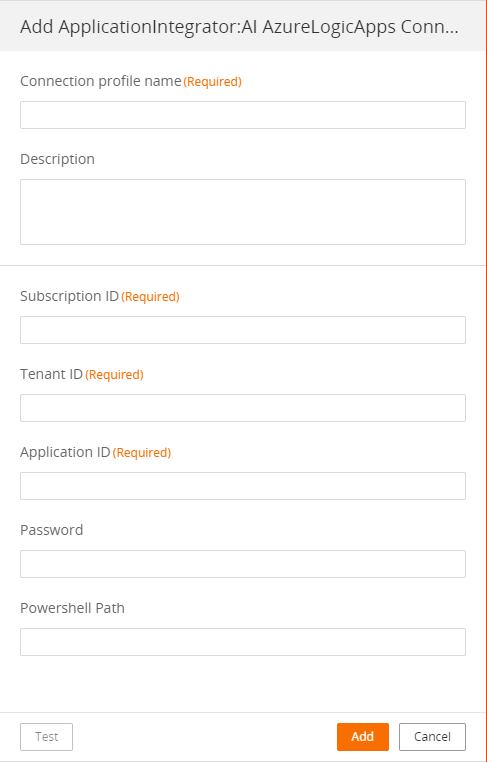
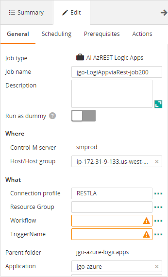
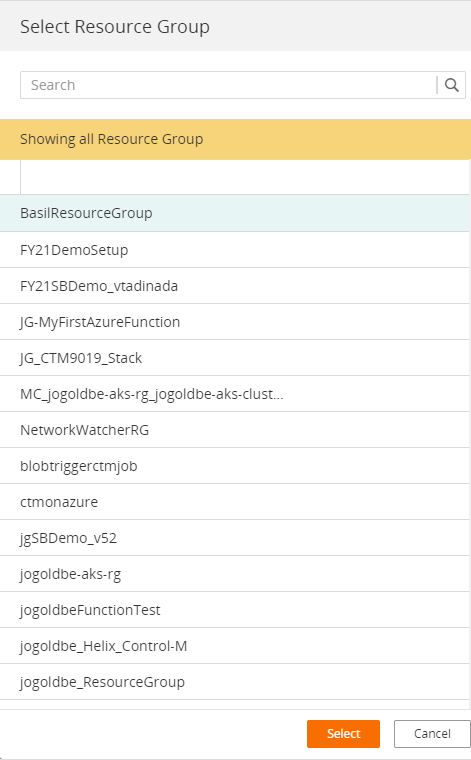
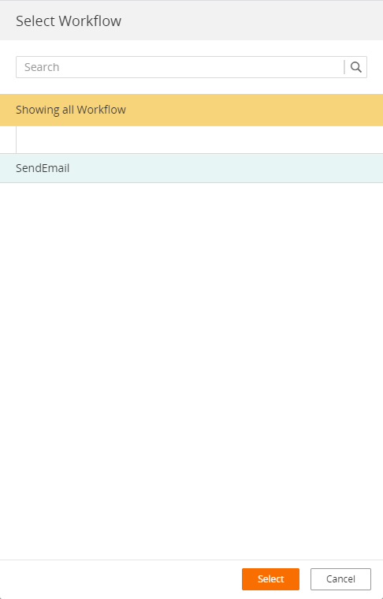
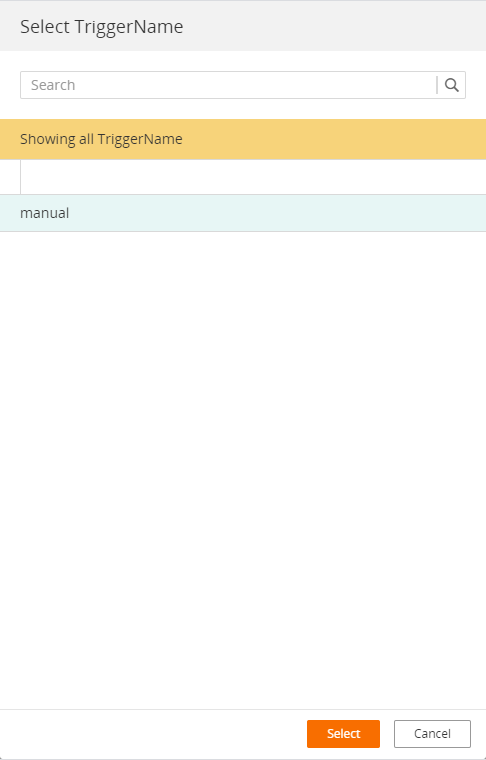
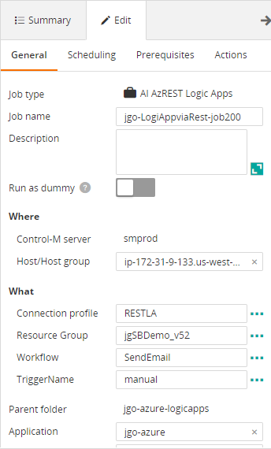
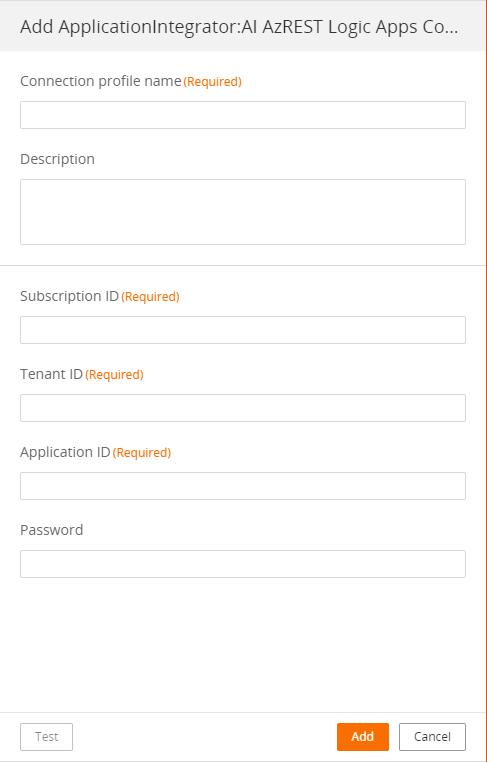

# Copyright © BMC Software, Inc. All rights reserved.

Access and use of the following is governed by the terms and conditions set forth in LICENSE in the project root.

Changes may cause incorrect behavior and will be lost if the code is regenerated.

# Control-M Integration for Azure Logic Apps
This folder contains sample Application Integrator jobtypes for running and monitoring Azure Logic Apps, a Microsoft Azure cloud service that helps to integrate apps, data, systems, and services across enterprises or organizations. 

__Note:__The authentication method used by these job types is OAUTH2 with a Service Principal (App Registration) and client secret. 

## Two job types
Both job types run an Azure Logic App, monitor it until completion and report on success or failure. 

### AI LogicAppviaREST.ctmai
This job type uses exclusively Azure REST APIs to run and monitor a Logic App. Upon completion, a brief summary of the Logic App run infromation is displayed similar to this:

```
'WORKFLOW_STATUS'==> 'Succeeded' 
'STARTTIME'==> '2021-04-11T16:12:02.7949029Z' 
'ENDTIME'==> '2021-04-11T16:12:34.5468479Z' 
'CLIENT_TRACKING_ID'==> '08585834493626840076315186327CU00'
```

### AI AzureLogicApps.ctmai
This job type uses REST to start and monitor the Logic App and a PowerShell script to display detailed information about the execution. The script is invoked as the last step in the job process and produces output similar to what can be seen from the Azure console by selecting each activity in the "Logic app run" blade. For a simple Logic App with an HTTP trigger and a "Send email" action, the output would appear similar to this:

```
Activity: Response
Status: Skipped
Code: ActionResponseSkipped
Start: 04/11/2021 18:56:01 End: 04/11/2021 18:56:01
Activity Ouput:
==============================================================================================
Account SubscriptionName
------- ----------------
<Subscription name here>
{
"statusCode": "200"
}
==============================================================================================
Activity: Send_email_(V2)
Status: Succeeded
Code: OK
Start: 04/11/2021 18:56:01 End: 04/11/2021 18:56:33
Activity Ouput:
==============================================================================================
{
"method": "post",
"path": "/v2/Mail",
"host": {
"connection": {
"name": "/subscriptions/<subscription id>/resourceGroups/<resource group name>/providers/Microsoft.Web/connections/\
gmail"
}
},
"body": {
"Body": "<p>From your friendly neighborhood Logic App at2021-04-11T18:56:01.3915324Z</p>",
"Subject": "Azure Logic App run by Control-M",
"To": "joe_goldberg@bmc.com"
}
}
```

## Prerequisites and installation notes:

These job type have the following prerequisites:

* Control-M Agent with Application Integrator 9.0.20.000 or newer, deployed
* For "AI AzureLogicApps.ctmai", PowerShell 7 or higher, installed on Windows and Linux with Azure PowerShell library installed

### Installation steps:

* Deploy the selected job type to the agent via the Application Integrator graphical UI or via Automation API. 
* For "AI AzureLogicApps.ctmai", copy the PowerShell script to the agent machine(s)
* Configure a connection profile containing an Azure Tenant ID, Subscription ID,  Service Principal, Client secret and for "AI AzureLogicApps.ctmai", fully qualified path of the PowerShell script
* Create your first job

### Compatibility:

* Platforms: This job type was tested on both Linux and Windows.
* Control-M: Tested on Control-M 9.0.19.200 and 9.0.20.000
* Connection Profile: Can be either Centralized or Local

## Web Interface
The connection profiles and job forms are very similar for both job types. The only differences are the job types. The screen shots below show some examples.
### AzREST Logic Apps
This is a centralized connection profile (local profiles are also supported).



Attribute|Description
---------|-----------
Subscription ID|Azure subscription id of the Logic App you wish to run
Tenant ID|Azure tenant ID of the Logic App
Application ID|Azure App Registration (also known as Service Principal) that has permission to run the desired Logic App
Passoword|An active client secret for the Application ID above
Powershell Path|Full qualified path where the Powrshell script is located. This parameter is only for the AzureLogicApps job tpe which uses the Powershell script, included in this folder, to format the Logic App results.

Note that the job form is almost identical (only the jobtype is different) for both job types. Once a connection profile is selected, you can use the elipsis (...) next to each field to retrieve from Azure the available values for each field and you can select the desired one from the list. Here is the empty form:



Press the elipsis next to Resource Group to get a selection list like this:



Repat for the Workflow field:



And for the trigger:



You can also simply type in values if you know them. The complete job form should appear like this:



### Azure Logic Apps
This is the connection profile:



See above for the job form.

## Automation API
This folder has sample JSON for jobs and connectionn profiles for each of the job types.

### JSON atrifacts

* connectionProfile-LogicAppviaREST.json contains a sample connection profile for the jobtype that uses only REST
* connectionProfile-AzureLogicApps.json contains a sample connection profile for the jobtype that uses a PowerShell script
* jgo-azure-logicapps.json sample jobs for each job type

## Powershell Script

* AzureLogicApps_QueryActivity.ps1 uses the same credentials (the App Registration/Service Principal) that is specified in the Connection Profile. 